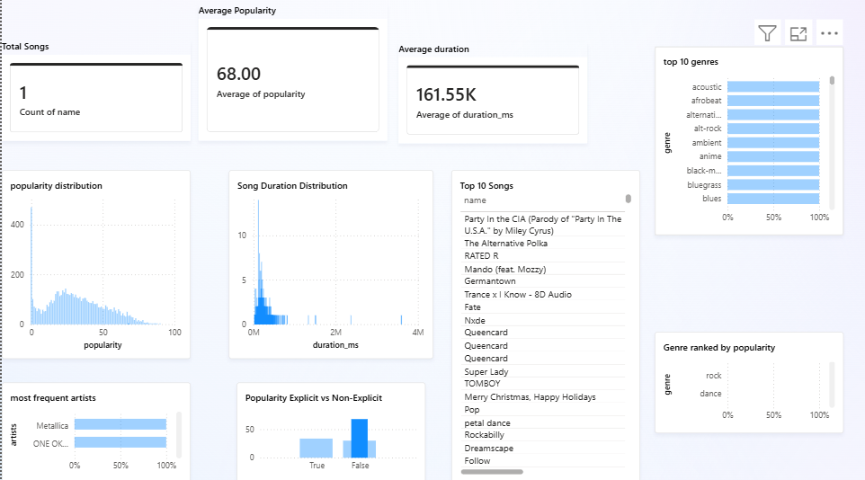

# spotify-eda-powerbi
Exploratory Data Analysis of Spotify songs using Python and Power BI
# 🎧 Spotify Songs EDA & Power BI Dashboard

## 📌 Project Overview
This project performs Exploratory Data Analysis (EDA) on a Spotify songs dataset
using Python and visualizes insights using Power BI.

The goal is to understand patterns in song popularity, genres, artists, duration,
and explicit content.

---

## 🧰 Tools Used
- Python (Pandas, NumPy, Matplotlib, Seaborn)
- Jupyter Notebook
- Power BI
- GitHub

---

## 📂 Dataset
The dataset contains 6,300 Spotify tracks with the following attributes:
- Song name
- Artist
- Genre
- Popularity score
- Duration (ms)
- Explicit flag

---

## 🔍 Exploratory Data Analysis
The EDA includes:
- Popularity distribution analysis
- Genre frequency and popularity analysis
- Artist analysis
- Song duration analysis
- Explicit vs non-explicit comparison
- Correlation analysis

📸 **EDA Visuals:**

---

## 📊 Power BI Dashboard
An interactive Power BI dashboard was created to visualize:
- Total number of songs
- Average popularity
- Average song duration
- Top 10 genres
- Top artists
- Popularity distribution
- Explicit vs non-explicit comparison
- Top 10 songs

📸 **Dashboard Preview:**

---

## 🧠 Key Insights
- Most songs fall within a mid popularity range.
- Song duration mostly lies between 2–4 minutes.
- Explicit content does not significantly impact popularity.
- Genre and artist trends influence popularity more than duration.

---

## 🚀 Future Work
- Include audio features such as danceability, energy, tempo.
- Analyze trends over time using release date.
- Build popularity prediction models.

---

## ✅ Conclusion
This project demonstrates real-world data analysis skills using Python and Power BI
and showcases end-to-end analytics suitable for a Data Analyst portfolio.
